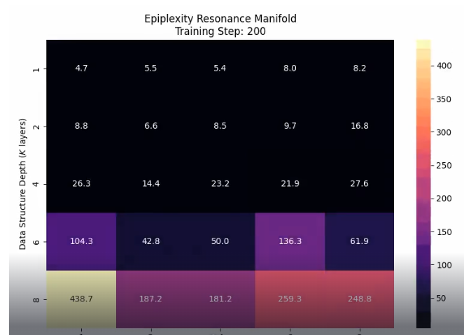

# Keypoints' detection

- [x] Data preprocessing
  - [x] Extract age from captions
  - [x] Extract age from ratios
  - [x] Manual verification
- [x] Training
  - [x] Keypoints to heatmap
  - [x] Model training loop
  - [ ] Add backbone freezing
  - [ ] Explain the choice of each layer
- [x] Optuna
  - [ ] Add more metrics
- [x] Validation
  - [x] Model validation loop
  - [x] Heatmap to keypoints
  - [ ] Add more metrics
  - [ ] Add epiplexity from this [paper](https://arxiv.org/abs/2601.03220) 
  
    information is observer-dependent. trained student network (depth L) to predict output from the teacher networks (depth K) epiplexity - area under loss curve student too shallow -> high epiplexity (left bottom), model struggles inf capacity ~ complexity -> actual structure extraction, loss drops, acc area reflects structure

    

- [ ] Model combination
  - [x] Extract bounding boxes
  - [ ] Generate crop json
  - [ ] Run inference on new data
- [ ] Visualisation
  - [x] Keypoint heatmap
  - [ ] Accuracy heatmap
  - [x] Visualise keypoints

